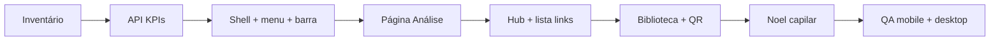

# Pro Estética Capilar = mesmo painel que o Corporal

Guia para equipa de desenvolvimento: **o ecrã deve parecer o mesmo produto**; só muda a **língua da área** (corpo → cabelo/couro cabeludo) e os **dados** (tenant, links, biblioteca, Noel).

---

## Em 30 segundos

| Pergunta | Resposta |
|----------|----------|
| O que copiar? | **Layout:** espaçamentos, ordem dos blocos, header, KPIs, abas do hub, lista, análise, QR na biblioteca. |
| O que não copiar à letra? | **Palavras:** títulos, tooltips, Noel, SQL da biblioteca — tudo no tom **terapia capilar**. |
| Onde está o “original”? | Pasta `pro-estetica-corporal` + componentes listados [abaixo](#mapa-rápido-corporal--capilar). |
| Por onde começo? | [Ordem recomendada](#ordem-de-trabalho-fases) — API e shell primeiro, depois análise e hub. |

**Regra de ouro:** se no capilar **o sítio** de um botão ou bloco for diferente do corporal **e não for copy**, é paridade em falta.

---

## Índice

1. [Em 30 segundos](#em-30-segundos)
2. [Mapa rápido Corporal → Capilar](#mapa-rápido-corporal--capilar)
3. [Fluxo do projeto (visão geral)](#fluxo-do-projeto-visão-geral)
4. [Ordem de trabalho (fases)](#ordem-de-trabalho-fases)
5. [Checklist “está igual ao corporal?”](#checklist-está-igual-ao-corporal)
6. [Glossário: corporal → capilar](#glossário-corporal--capilar)
7. [Decisões e riscos](#decisões-e-riscos)
8. [Histórico](#histórico)

---

## Mapa rápido Corporal → Capilar

Abre o ficheiro da **coluna Esquerda**; a tua entrega espelha na **coluna Direita** (mesma estrutura de UI).

| O quê | Corporal (referência) | Capilar (onde implementar) |
|-------|------------------------|----------------------------|
| Shell do painel | `ProEsteticaCorporalAreaShell.tsx` | `ProEsteticaCapilarAreaShell.tsx` |
| Menu lateral | `ProEsteticaCorporalSidebar` + `pro-estetica-corporal-menu` | `ProEsteticaCapilarSidebar` + config de menu capilar |
| Telemóvel | `ProEsteticaCorporalMobileNav` | Criar / alinhar equivalente |
| Barra de KPIs | `ProEsteticaCorporalCyberLinkAnalyticsBar` | Barra nova com URL `/api/pro-estetica-capilar/...` |
| API dos números | `api/pro-estetica-corporal/links-analytics-summary` | `api/pro-estetica-capilar/links-analytics-summary` |
| Hub Links (abas) | `LinksHubContent` + `bibliotecaEsteticaCorporalScope` | Mesmo componente + `bibliotecaEsteticaCapilarScope` |
| Lista / criar links | `LinksPageContent` (modo Pro hub) | Mesmas props / fluxo; copy capilar |
| Biblioteca + QR | `BibliotecaPageContent`, `DiagnosticoLinkQrPanel` | Igual; scope e textos capilares |
| Página Análise | `painel/links-analise` (corporal) | `painel/links-analise` (capilar), mesma grelha |

---

## Fluxo do projeto (visão geral)

Cada caixa pode ser **um PR** (ou dois PRs se a alteração for grande).

---

## Ordem de trabalho (fases)

Para cada fase: **Abrir referência corporal → replicar estrutura no capilar → trocar só textos e URLs.**

### Fase 0 — Inventário (curto)

- **Fazes:** lista de rotas `pro-estetica-corporal/painel` vs `pro-estetica-capilar/painel`; APIs em `api/pro-estetica-*`.
- **Feito quando:** tens uma tabela ou nota com “já existe / falta”.

### Fase 1 — API `links-analytics-summary` (capilar)

- **Fazes:** copiar lógica da rota corporal; filtros e tenant **capilares**.
- **Feito quando:** `GET` devolve totais coerentes (ex.: links ativos, views, WhatsApp) para uma conta de teste.

### Fase 2 — Shell, header, KPIs, menu

- **Fazes:** alinhar header (sticky, avatar/menu se no corporal), **faixa de KPIs** logo abaixo como no corporal; avisos de pré-visualização / dev com o **mesmo tipo** de bloco (só texto capilar).
- **Feito quando:** abres corporal e capilar lado a lado e a **zona cinzenta/branca** encaixa igual; só mudam rótulos e números.

### Fase 3 — Entrada “Análise” + página `links-analise`

- **Fazes:** item no menu + rota; página com as **mesmas** ordenações e colunas que o corporal.
- **Feito quando:** ordenar por cliques / diagnósticos / WhatsApp funciona com dados capilares.

### Fase 4 — Hub de links (Biblioteca / Os teus links)

- **Fazes:** abas, nota cinzenta, sem QR duplicado; lista com pesquisa, presets Pro Líderes, “Criar outro link”, estado vazio.
- **Feito quando:** o fluxo no hub **parece** o do corporal; textos falam em capilar.

### Fase 5 — Biblioteca (criar link + QR + copiar imagem)

- **Fazes:** após “Criar e copiar”, painel QR igual ao corporal (`ylada-qrcode-share`, etc.).
- **Feito quando:** criar link → QR → copiar imagem funciona como no corporal.

### Fase 6 — Noel

- **Fazes:** API + UI; prompts e exemplos **só** contexto capilar; sugestões alinhadas à biblioteca capilar.
- **Feito quando:** conversas de teste não misturam linguagem de corpo.

### Fase 7 — QA e regressões

- **Fazes:** percorrer criar link (biblioteca + Noel), lista, QR, análise, KPIs; **rotas antigas** capilar (ex.: catálogo → biblioteca-links) continuam a funcionar.
- **Feito quando:** checklist [abaixo](#checklist-está-igual-ao-corporal) verde.

---

## Checklist “está igual ao corporal?”

Marca ao implementar:

- [ ] Sidebar + área principal + header na mesma hierarquia
- [ ] Faixa de KPIs no mesmo sítio (relativamente ao header)
- [ ] Hub: 2 abas + texto a explicar Biblioteca vs “Os teus links”
- [ ] Lista: pesquisa + ligação lógica à página de análise
- [ ] Sem QR repetido no hub; QR na biblioteca após criar link + copiar imagem
- [ ] Estados vazios com a **mesma composição** (só copy/images capilares)
- [ ] Nav em ecrã pequeno com a mesma “lógica” que o corporal (grelhas, mais colunas se aplicável)
- [ ] Português consistente (acentos, “pré-visualização”, etc.)

---

## Glossário: corporal → capilar

Serve para **substituir texto**, não para mudar o desenho do ecrã.

| Ideia no corporal | Exemplos no capilar |
|-------------------|---------------------|
| Corpo / estética corporal | Terapia capilar / tricologia / couro cabeludo |
| Tratamentos “de corpo” | Queda, densidade, cronograma, hidratação do fio, etc. |
| Diagnóstico (produto) | Manter se for o mesmo conceito no funil |

**Claims médicos ou resultados garantidos:** validar com produto **antes** de SQL em massa na biblioteca.

---

## Decisões e riscos

| Tema | Nota |
|------|------|
| `proEsteticaCorporalEmbedded` | Nome legado no código; renomear pode ser **PR à parte** para não misturar com layout. |
| Menu capilar com mais itens | Produto decide MVP vs menu completo; **estilo** dos itens = corporal. |
| Código duplicado | Preferir componentes **parametrizados** (URL da API, base path, labels) para o corporal e capilar não divergirem com o tempo. |

---

## Histórico

| Data | Alteração |
|------|-----------|
| 2026-04-29 | Criação do guia; reestruturação com resumo, índice, mapa rápido, fluxo mermaid, fases com “feito quando”, checklist e riscos em tabela. |
